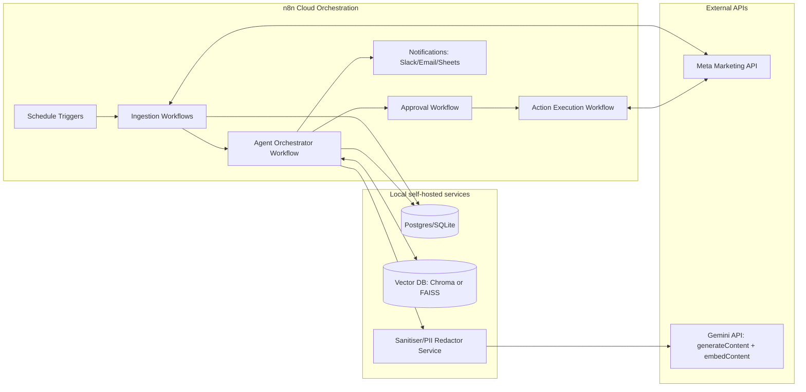
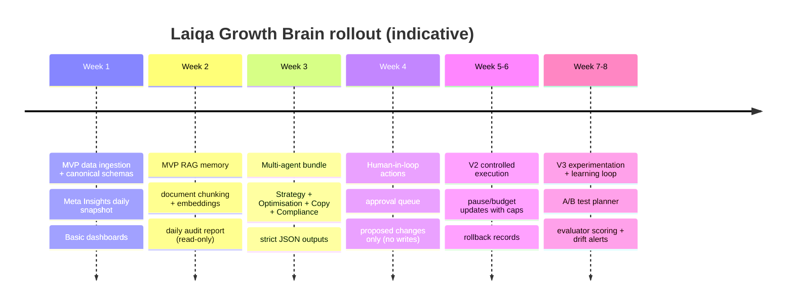

# Production‑grade multi‑agent AI Growth Agent for Laiqa

## Executive summary

This PRD defines a production‑grade “AI Growth Agent” for Laiqa: a multi‑agent system that (1) ingests business knowledge + creative library + Meta Ads performance, (2) stores them as canonical facts (SQL) and retrievable memory (vector DB), (3) generates daily audits and action proposals (scale/pause/creative refresh/targeting tests), and (4) can optionally execute changes in Meta Ads **only with human approval and compliance gates**.

The recommended architecture uses **n8n Cloud** as the orchestration layer (schedulers, approvals, notifications), **Gemini API** for generation + embeddings with strict structured outputs, and locally self‑hosted services for data control and cost discipline: **Postgres/SQLite** (canonical store) plus a local vector DB (**Chroma** for most teams; **FAISS** for maximum performance/control). Gemini supports JSON‑schema‑constrained structured outputs (critical for tool‑calling and deterministic pipelines) and provides embeddings via `embedContent`. citeturn6view0turn6view1turn6view2

Because Laiqa operates in women’s health, the system must include a dedicated **Compliance Agent** and hard‑coded policy gates to avoid common disapproval causes (personal attributes, sensitive health framing, privacy/PII). Meta’s advertising standards specifically restrict ads that ask for or assert personal attributes or private information, and health/wellness policies restrict negative self‑perception and sensitive content patterns. citeturn1search8turn1search1

Free‑tier operation is feasible for MVP analysis, but Gemini’s free tier explicitly states **content may be used to improve products**; therefore, the PRD includes anonymisation/minimisation rules and a “no sensitive data to LLM” policy by default. citeturn5view3

## Product vision and scope

**Vision**  
An always‑on “Growth Brain” that turns scattered marketing assets and performance data into daily, actionable decisions: which campaigns to scale/pause, which creatives are fatigued, what new copy variants to test, and what tracking/data issues to fix—while staying safe for a health brand.

**Primary outcomes**
1) Reduce manual reporting + analysis time; 2) increase marketing learning velocity; 3) minimise policy/disapproval risk; 4) improve efficiency (CPA/ROAS) through earlier detection of waste and fatigue.

**In scope**
- Read‑only ingestion of Meta Ads reporting (Insights) for campaigns/ad sets/ads (daily + rolling windows).
- RAG knowledge base from: offers, audience hypotheses, brand voice, landing page copy, creative scripts, past test learnings, and (optionally) D2C catalogue and promotions.
- Daily/weekly audit reports with strict JSON outputs + human‑readable narrative.
- Action proposals (budgets, pausing, creative refresh brief), queued for human approval.
- Optional write actions to Meta Ads (pause, budget adjustment, duplication, new ad set) via gated workflow; support async/batch requests if needed. citeturn10search1turn10search3

**Out of scope (explicit)**
- Fully autonomous spending changes without human approval.
- User‑level health profiling or medical advice generation.
- Uploading raw customer PII or sensitive health data into LLM prompts (especially on free tier).
- Black‑box “LLM decides everything”: core decisions must be explainable and threshold‑auditable.

**Key placeholders (to configure)**
`{AD_ACCOUNT_ID}`, `{PIXEL_ID}`, `{TARGET_CPA}`, `{TARGET_ROAS}`, `{MAX_DAILY_BUDGET_CHANGE_%}`, `{FATIGUE_FREQ_THRESHOLD}`, `{MIN_CONVERSIONS_FOR_SCALE}`, `{ATTRIBUTION_WINDOW}`, `{DATA_RETENTION_TTL_DAYS}`.

## Users and success metrics

**User personas**
- Performance Marketer (day‑to‑day): needs daily “what to do next” and confidence scores.
- Founder/GM: needs weekly growth narrative, spend pacing, strategic recommendations.
- Creative Strategist: needs creative brief + variants tied to winning patterns and compliance.
- Compliance Reviewer: needs policy‑risk flags and audit trail.
- Data/Ops Engineer: needs reliability, clear schemas, observability, rollback.

**Business success metrics (north‑star + supporting)**
- **Time‑to‑insight**: minutes from day close to report delivered (target: <15 min).
- **Action adoption rate**: % of AI proposals approved by humans (indicates trust).
- **Efficiency lift**: ΔCPA/ΔROAS versus baseline period controlling for spend (tracked via experimentation agent).
- **Waste reduction**: spend on ad sets flagged as “high spend/zero outcomes” after X days.
- **Compliance stability**: disapproval rate and “limited learning” flags trend (target: down).

**Technical success metrics**
- **Data freshness SLA**: Meta insights available and ingested by `{T+N}` hours; handle rate limits and retries.
- **Schema integrity**: % ingestions passing validation (target: >99%).
- **Structured output validity**: % agent responses that validate against JSON schema (target: >99.5%) using Gemini structured outputs. citeturn6view0turn6view1
- **Retrieval quality**: Recall@K for known “golden queries” and reduction in hallucinated facts (measured via evaluator agent).
- **Cost per day**: tokens + executions; enforce budget caps.

## Multi‑agent architecture and responsibilities

### System architecture



Key enablers: Gemini structured outputs (JSON schema) for deterministic tool contracts, embeddings via `embedContent`, and Chroma metadata filtering for scoped retrieval. citeturn6view0turn6view2turn6view3

### Agent roster (roles & responsibilities)

| Agent | R&R (what it owns) | Inputs | Outputs (strict JSON) | Hard gates / constraints |
|---|---|---|---|---|
| Orchestrator | Plans task DAG; routes messages; resolves conflicts; enforces gates | Task requests, metrics snapshot, retrieval results | `RunPlan`, `TaskDispatch`, `FinalReportBundle` | Never executes ads writes without approval token |
| Data Engineer | Data reliability: ingestion, canonical schemas, validation, backfills | Meta pulls, store orders, UTM logs | `IngestionStatus`, `SchemaErrors`, `BackfillPlan` | Blocks downstream if data completeness < threshold |
| Strategy | Offer/audience/funnel diagnosis; prioritised hypotheses | Business KB, historical tests, performance deltas | `StrategyBrief` | Must cite evidence IDs; no personal-attribute targeting claims |
| Copywriting | Creates compliant copy variants + creative briefs tied to learnings | Brand voice, winners/losers, compliance constraints | `CreativeBrief`, `CopyVariants` | Must pass Compliance Agent |
| Optimisation | Scale/pause/budget realloc rules + pacing detection | KPIs, spend, constraints `{TARGET_CPA}` etc | `ActionPlan` | Budget changes capped; requires minimum conversion volume |
| Compliance | Policy risk scan + redlines; health/wellness + privacy gates | Proposed copy, targeting notes, landing page summary | `ComplianceVerdict` | Hard‑fail on personal attributes & privacy risks per policy summaries citeturn1search8turn1search1 |
| Experimentation | A/B plan, holdouts, learning agenda, evaluation | Proposed actions, test history | `ExperimentPlan`, `SuccessCriteria` | Enforces one‑change‑at‑a‑time for key experiments |
| Evaluator/Critic | Lints outputs: schema validity, factual claims, evidence links | All agent JSON + citations to data rows | `QualityReport`, `RejectReasons` | Reject if low confidence + high impact action |

### Multi‑agent interaction pattern and contracts

**Pattern**: Orchestrator runs a “plan → retrieve → propose → critique → approve → execute” loop. This is “agentic” but bounded: the LLM proposes; deterministic code decides what is eligible to act on.

**Canonical message envelope (internal contract)**
```json
{
  "schema_version": "1.0",
  "correlation_id": "uuid",
  "task_type": "DAILY_AUDIT | CREATIVE_REFRESH | BUDGET_PLAN | COMPLIANCE_REVIEW | EXECUTE_ACTIONS",
  "tenant": "laiqa",
  "time_window": {"start": "YYYY-MM-DD", "end": "YYYY-MM-DD"},
  "constraints": {
    "target_cpa": "<TARGET_CPA>",
    "max_budget_change_pct": "<MAX_DAILY_BUDGET_CHANGE_%>"
  },
  "inputs": [
    {"type": "sql_ref", "id": "meta_daily_snapshot:2026-03-25"},
    {"type": "retrieval_ref", "id": "rag_context_pack:abc"}
  ],
  "required_output_schema": "ActionPlan.v1",
  "risk_level": "LOW | MEDIUM | HIGH"
}
```

## Data and RAG design

### Canonical data model (SQL) and vector model

**Principle**: SQL is the system of record (facts, metrics, actions, approvals). Vector DB is memory (similarity search over chunks).

**Core SQL tables (minimum)**
- `meta_entities` (campaign/adset/ad IDs, names, status, objective)
- `meta_insights_daily` (grain: `{date, entity_level, entity_id, breakdown_key?}`)
- `creative_assets` (creative_id, type, copy, hook, landing_url, compliance_tags)
- `experiments` (hypothesis, variants, start/end, decision)
- `agent_runs` (correlation_id, agent_name, inputs_hash, outputs_json, status)
- `approvals` (action_plan_id, approver, decision, timestamp)
- `actions_executed` (meta_api_calls, status, rollback_ref)

**Vector “document” types**
- `BUSINESS_STRATEGY`: ICP, positioning, offers, contraindications (marketing claims rules)
- `BRAND_VOICE`: tone, forbidden phrases, compliance guidelines
- `CREATIVE_SCRIPT`: video scripts, UGC hooks, ad copy bodies
- `PERFORMANCE_CARD`: text‑serialised KPI row for an ad/ad set with outcome label (winner/loser)
- `LANDING_PAGE_SNAPSHOT`: product page copy and FAQs (sanitised)
- `CUSTOMER_FEEDBACK` (optional; scrub PII)

RAG is a standard way to combine generation with retrieval from a dense vector index (“non‑parametric memory”), improving groundedness and updatability. citeturn10search0

### Ingestion and preprocessing pipeline

**Meta ingestion**
- Use Insights endpoints at campaign/ad set/ad level; store raw JSON + normalised rows.
- Add a “completeness check” (expected number of active entities, non‑null spend/impressions) before downstream agents run.

**Chunking + anonymisation**
- Chunk size: 300–600 tokens per chunk with semantic boundaries (headings, bullet lists).
- Redact: emails, phone numbers, order IDs, addresses; remove any health‑sensitive user statements in free tier prompts.
- Attach metadata to every chunk: `{doc_type, source, entity_id, date_range, funnel_stage, language, version}`.

**Embedding**
- Use Gemini embeddings via `embedContent`; Gemini offers both text‑only (`gemini-embedding-001`) and a multimodal preview model (`gemini-embedding-2-preview`). citeturn6view2

### Vector DB design and retrieval strategy

**Recommended default: Chroma (local persistent)**
- Supports persistent storage and is designed for local/server deployment; persistent client saves to disk. citeturn9view0turn9view1
- Supports metadata filtering using `where` filters and logical operators, enabling “retrieve only last 30 days winners for this funnel stage”. citeturn6view3

**Alternative: FAISS (max control/perf)**
- Efficient similarity search library supporting L2 / dot product (and cosine via normalisation), with multiple index types and GPU options. citeturn9view2

**Managed option: Pinecone (not local, but benchmark reference)**
- Dense vs sparse indexes; supports hybrid search; index creation requires specifying dimension + similarity metric. citeturn9view3turn11view0

#### Vector DB comparison

| Option | Best for | Pros | Cons | Fit for your constraints |
|---|---|---|---|---|
| **entity["organization","Chroma","vector db project"]** | Fast MVP → production local | Persistence + metadata filtering; simple ops; client/server | Still needs local ops/backups | Strong default for “n8n cloud + local stack” citeturn6view3turn9view0 |
| **entity["organization","FAISS","similarity search library"]** | High‑performance custom | Many ANN indexes; CPU/GPU; flexible similarity metrics | You build persistence + filtering layer | Best when you have an engineer and strict performance needs citeturn9view2 |
| **entity["company","Pinecone","vector database vendor"]** | Managed scaling | Production managed; hybrid concepts; metadata indexing options | Not local; ongoing cost; compliance/vendor risk | Useful later if you outgrow local and accept SaaS citeturn11view0turn9view3 |

**Retrieval policy (production)**
- Hybrid retrieval: vector top‑K (e.g., 20) → re‑filter by metadata → select final context budget (e.g., 6–10 chunks).
- Recency boost: prefer last `{N}` days for performance cards unless question is “evergreen strategy”.
- TTL: performance cards older than `{DATA_RETENTION_TTL_DAYS}` expire from vector store but remain in SQL for audit.

**Backups**
- Chroma: snapshot persistent directory nightly + store checksum in SQL. citeturn9view0
- FAISS: persist index file + separate metadata store in SQL; rebuild possible from canonical documents.

## Workflows, prompts, schemas, and decision rules

### Tool & API matrix

| Tool | Hosting | Purpose | Auth | Notes |
|---|---|---|---|---|
| n8n Cloud (pricing/executions) | Cloud | Orchestration, approvals, notifications | n8n credentials + nodes | Cloud pricing based on workflow executions. citeturn4search27 |
| Gemini API | Cloud | Generation + embeddings | API key | Free tier content used to improve products; paid tier says not used. citeturn5view3 |
| Meta Marketing API | Cloud | Read insights; optional write actions | OAuth/system user tokens | Rate limiting depends on CPU + wall time and supports async/batch. citeturn10search3turn10search1 |
| Local Postgres/SQLite | Local | Canonical facts + audits + approvals | local creds | SQLite fine for MVP; Postgres for concurrency |
| Slack/Email | Cloud | Human approvals + alerts | webhook/OAuth | Approval is a hard gate |
| Google Sheets | Cloud | Lightweight BI + sharing | OAuth | Optional “single source of truth for non‑technical stakeholders” |

### Integration endpoints (practical reference)

| Integration | Endpoint pattern | Method | Auth | Rate‑limit notes |
|---|---|---|---|---|
| Gemini embeddings | `/v1beta/models/gemini-embedding-001:embedContent` | POST | API key | Batch where possible; minimise tokens. citeturn6view2 |
| Gemini generation | `/v1beta/models/{model}:generateContent` | POST | API key | Use `responseMimeType=application/json` + schema. citeturn6view1 |
| Gemini batch | `/v1beta/models/{model}:batchGenerateContent` | POST | API key | Paid tier notes Batch API cost reduction. citeturn5view3 |
| Meta Insights | `https://graph.facebook.com/v{ver}/act_{AD_ACCOUNT_ID}/insights` | GET | OAuth token | CPU/wall‑time based throttling. citeturn10search3 |
| Meta async/batch | `{ad_account}/async_batch_requests` | POST | OAuth token | Use to avoid blocking on large jobs. citeturn10search5turn10search1 |
| n8n Public API | `{n8n}/api/v1/...` | GET/POST | `X-N8N-API-KEY` | Not available on free trial; Cloud supported with API key. citeturn7view2turn4search3 |

### Exact n8n workflow outlines

#### Workflow 1: Ingestion (Meta → SQL)
**Trigger**: Cron daily `{07:00 IST}` + optional hourly lightweight refresh  
**Nodes (sequence)**
1) Schedule Trigger  
2) HTTP Request: Meta Insights (campaign level)  
3) HTTP Request: Meta Insights (ad set level)  
4) HTTP Request: Meta Insights (ad level for top spenders)  
5) Code: normalise → canonical schema + derived KPIs  
6) IF: completeness check (e.g., spend>0 rows present, entity count within bounds)  
7) Postgres/SQLite: upsert `meta_insights_daily` + `meta_entities`  
8) Error Trigger / Slack alert on failure

#### Workflow 2: Embedding refresh (SQL/docs → Vector DB)
**Trigger**: After successful ingestion OR when new docs/creatives uploaded  
**Nodes**
1) Trigger (Webhook or Execute Workflow)  
2) SQL: fetch new/changed documents since last run  
3) Code: chunk + attach metadata + redact sensitive tokens  
4) HTTP Request: Gemini `embedContent` (batched)  
5) HTTP Request: local Vector DB upsert (Chroma server API or custom service)  
6) SQL: write `embedding_job_run` + checksum

#### Workflow 3: Daily audit (RAG + multi‑agent bundle)
**Trigger**: After embedding refresh  
**Nodes**
1) Execute Workflow: build “context pack” (retrieve top chunks by query templates)  
2) HTTP Request: Gemini generateContent (Strategy Agent schema)  
3) HTTP Request: Gemini generateContent (Optimisation Agent schema)  
4) HTTP Request: Gemini generateContent (Copywriting Agent schema)  
5) HTTP Request: Gemini generateContent (Compliance Agent schema)  
6) Code: assemble `DailyReportBundle` + attach evidence IDs  
7) Slack/Email/Sheets: deliver report

#### Workflow 4: Action proposal queue (human‑in‑loop)
**Trigger**: When `ActionPlan` generated and compliance passes  
**Nodes**
1) IF: `ComplianceVerdict.status == PASS`  
2) SQL: write `action_plans` (status=PENDING_APPROVAL)  
3) Slack: interactive message “Approve / Reject / Request changes”  
4) Wait: webhook callback capture decision  
5) SQL: write `approvals`

#### Workflow 5: Action execution (Meta writes + rollback)
**Trigger**: `approval.status == APPROVED`  
**Nodes**
1) SQL: load approved actions  
2) Code: enforce final hard rules (caps, min conversions, blacklists)  
3) HTTP Request: Meta API write calls (pause/budget/duplicate)  
4) SQL: write `actions_executed` with API responses  
5) Slack: post confirmation + rollback instructions  
6) On error: stop + alert + mark plan FAILED

### Gemini API request bodies (samples)

**Embeddings (`embedContent`)**
```json
{
  "model": "gemini-embedding-001",
  "content": {
    "parts": [
      {
        "text": "DOC_TYPE=CREATIVE_SCRIPT\nFUNNEL_STAGE=TOFU\nTEXT=..."
      }
    ]
  }
}
```
Gemini embeddings are generated via `embedContent`, and `gemini-embedding-001` remains available for text‑only use cases. citeturn6view2

**Generation with strict JSON schema (`generateContent`)**
```json
{
  "contents": [
    {
      "role": "user",
      "parts": [
        { "text": "You are the Optimisation Agent. Return ONLY JSON matching the schema." },
        { "text": "CONTEXT_PACK:\n<insert retrieved chunks + KPI snapshot>" }
      ]
    }
  ],
  "generationConfig": {
    "responseMimeType": "application/json",
    "responseSchema": {
      "type": "object",
      "required": ["actions", "summary", "confidence"],
      "properties": {
        "summary": { "type": "string" },
        "confidence": { "type": "number", "minimum": 0, "maximum": 1 },
        "actions": {
          "type": "array",
          "items": {
            "type": "object",
            "required": ["entity_level", "entity_id", "action_type", "rationale", "risk"],
            "properties": {
              "entity_level": { "type": "string", "enum": ["campaign", "adset", "ad"] },
              "entity_id": { "type": "string" },
              "action_type": { "type": "string", "enum": ["pause", "scale_budget", "refresh_creative", "reallocate"] },
              "rationale": { "type": "string" },
              "risk": { "type": "string", "enum": ["low", "medium", "high"] }
            }
          }
        }
      }
    }
  }
}
```
Gemini supports `responseMimeType` and `responseSchema` for schema‑constrained outputs. citeturn6view1turn6view0

### Example JSON output schemas (agent outputs)

**ActionPlan.v1 (example)**
```json
{
  "$schema": "https://json-schema.org/draft/2020-12/schema",
  "title": "ActionPlan.v1",
  "type": "object",
  "required": ["date", "account_id", "actions", "guardrails", "evidence_refs"],
  "properties": {
    "date": { "type": "string", "format": "date" },
    "account_id": { "type": "string" },
    "actions": {
      "type": "array",
      "items": {
        "type": "object",
        "required": ["entity_level", "entity_id", "action", "delta", "why", "expected_impact", "confidence"],
        "properties": {
          "entity_level": { "type": "string", "enum": ["campaign", "adset", "ad"] },
          "entity_id": { "type": "string" },
          "action": { "type": "string" },
          "delta": { "type": "object" },
          "why": { "type": "string" },
          "expected_impact": { "type": "string" },
          "confidence": { "type": "number", "minimum": 0, "maximum": 1 }
        }
      }
    },
    "guardrails": { "type": "object" },
    "evidence_refs": { "type": "array", "items": { "type": "string" } }
  }
}
```

### Decision rules: hard‑code vs LLM

**Hard‑code in orchestration (non‑negotiable)**
- Budget change caps: `abs(change) <= {MAX_DAILY_BUDGET_CHANGE_%}`.
- Scale only if `conversions >= {MIN_CONVERSIONS_FOR_SCALE}` and CPA below `{TARGET_CPA}` over stable window.
- Pause candidates only if spend above threshold and outcomes below floor for N days.
- Compliance hard‑fails: personal attributes, private info requests, or prohibited health framing (do not let LLM “justify” it). citeturn1search8turn1search1
- Data completeness: if ingestion incomplete, send “data degraded” report and block actions.

**LLM tasks (value‑add)**
- Explaining patterns, diagnosing likely causes, proposing hypotheses.
- Generating compliant creative options and test briefs.
- Summarising learnings into weekly narrative.

## Operations, rollout, cost control, and risk register

### Safety & compliance gates

**Policy gates (health brand)**
- “Personal attributes / privacy” filter: reject copy that implies you know the viewer has a condition, is pregnant, has PCOS, etc., or asks for private info. citeturn1search8turn1search1
- “Negative self‑perception” filter for body/health shame framing (common health policy trigger). citeturn1search1
- Landing‑page claim guardrail: require evidence tags for any strong health claims; default to softer wellbeing claims and “not medical advice” disclaimers where needed (human legal review recommended).

**PII handling**
- Default: redact PII before embedding or generation.
- Store raw sensitive data only in your local database with access controls; never send to free‑tier LLM.

**Gemini free‑tier caveat**
- Gemini pricing explicitly states: Free tier includes “content used to improve our products”, while Paid tier says “content not used to improve our products”. Treat this as a major governance boundary. citeturn5view3

### Monitoring and observability

- n8n execution storage can be reduced and configured per workflow (e.g., save only errors), improving security and cost. citeturn7view0
- Log every agent run with: input hash, model/version, schema validation result, token estimates, and action eligibility decision.
- Drift detection: track KPI distributions per campaign type (CPM/CTR/CPA) and alert on abrupt shifts; measure “proposal accuracy” over time.
- Build dashboards (Sheets for MVP; later Grafana) for: ingestion success, report timeliness, approval rate, action win‑rate.

### CI/CD, testing, deployment patterns

- Version control n8n workflows by exporting as JSON; n8n documents export/import and warns exported JSON can contain credential names/headers—scrub before committing. citeturn7view1
- If your n8n Cloud plan includes the public API, authenticate via `X-N8N-API-KEY` and automate deployment to staging/prod instances. citeturn7view2turn4search3
- Add contract tests: validate every agent response against JSON schema before accepting; reject and retry with tighter prompt if invalid.
- Add “golden set” replay tests: run the same KPI snapshot through the system to ensure stable outputs across prompt/mode changes.

### Rollout plan with milestones (MVP → V2 → V3)



**MVP deliverables**
- Working ingestion + SQL schemas + daily report delivered to Slack/email.
- First RAG store of business docs + creative scripts + performance cards.
- Compliance agent that blocks risky copy.

**V2 deliverables**
- Action proposals with approvals, execution logs, rollback plan.
- Async/batch where needed for reliability under rate limits. citeturn10search1turn10search3

**V3 deliverables**
- Full experimentation and learning loop: store outcomes, update memory, generate weekly playbook.

### Rollback and human approval flows

- Every executed action stores a rollback reference (previous budget, previous status, previous targeting object).
- If performance dips or disapprovals spike, trigger automatic rollback proposal requiring approval.
- “Kill switch”: one configuration flag in n8n that disables all Meta write workflows globally.

### Cost control and free‑tier strategies

- Token minimisation: send compact KPI summaries (not raw exports).
- Batch embeddings and generation when possible; Gemini pricing highlights Batch API as a paid‑tier feature with cost advantages. citeturn5view3turn0search16
- Cache context packs in SQL; regenerate only when underlying data changes.
- Keep model selection tiered: cheaper model for drafting; stronger model for final compliance‑critical rewrite (if/when you move off free tier).

### Risk register

| Risk | Impact | Likelihood | Mitigation |
|---|---|---|---|
| Policy violations (health/personal attributes) | Account restrictions, lost spend | Medium‑High | Compliance agent hard‑fails; copy linter; human approval. citeturn1search8turn1search1 |
| Wrong scale/pause decisions | Financial loss | Medium | Hard thresholds + caps; minimum volume; evaluator agent; staged rollout. |
| Meta API throttling/rate limits | Pipeline failures | Medium | Backoff, async/batch jobs; fewer breakdown pulls; cache. citeturn10search3turn10search1 |
| Data mismatch vs Ads Manager (attribution) | Wrong conclusions | Medium | Store attribution window as variable; reconciliation checks; annotate latency. |
| Free tier content usage (privacy) | Governance risk | High | Redaction + minimisation; avoid sensitive data; move to paid tier for production. citeturn5view3 |
| Vector DB corruption / lost memory | Reduced quality | Low‑Medium | Nightly backups; rebuild from SQL documents. citeturn9view0 |
| Prompt/schema drift | Broken automation | Medium | Strict JSON schema validation; regression tests; version prompts. citeturn6view0turn6view1 |
| n8n Cloud plan limits (executions/API availability) | Ops constraint | Medium | Monitor execution volume; choose plan; export workflows as JSON for portability. citeturn4search27turn7view1 |

